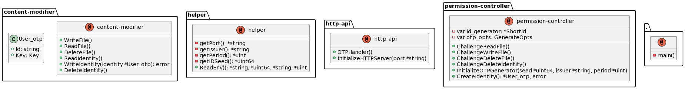

# OTP-Filemanager

## Run
1. Rename `.env-example` to `.env`
  * Set `HTTPPORT` 
  * Set `IDSEED` to a random numeric sequence
  * Set `ISSUER` to your service name with URL compatible characters 
  * Set `PERIOD` to seconds a OTP is valid
  * Set `MAXFILESIZEMB` to set the max size for an uploaded file
2. `go run main.go`

## Architecture

