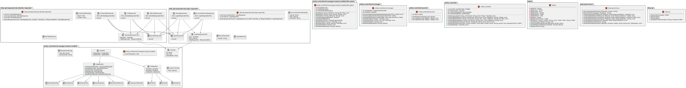

# OTP-Filemanager

A file server that allows to access files with a OTP-based authentication.
This server offers a simple interface, but also allows it do integrate into your application through
the endpoints, as it's stateless and relies on an up-to-date OTP.

## Run in Docker
1. Set environment variables in `docker-compose.yml`
2. Run `docker-compose up`

## Run a Build
1. Check branch `release/x.x`
2. Download `otp-filemanager-x.x.tar`
3. Set variables in `.env` (see below)
4. Run `./otp-filemanager-x.x`

## Run for Development
1. Run `./scripts/setup.sh` 
  * Set `HTTPPORT` 
  * Set `IDSEED` to a random numeric sequence
  * Set `ISSUER` to your service name with URL compatible characters 
  * Set `PERIOD` to seconds a OTP is valid
  * Set `MAXFILESIZEMB` to set the max size for an uploaded file
  * Set `MODIFIER` to set how the files and users are managed
  * Set `KEY` to a random 32 long string for encryption. Leave empty to disable it
  * Set `EXPIRATIONTIME` to set how long a user should exist until deleted in minutes. Set 0 for infinity
2. `go run main.go`

## How to Use

1. [Create Account](/docs/createAccount.md)
2. [Authentication](/docs/authentication.md)
3. [File and User Handler](/docs/fileHandler.md)

## Inner Workings
The authentication relies on a randomly generated username and OTP (currently only TOTP).
The password has to be up-to-date, as no other authentication method is used for the user actions.

Files and user related information are saved directly to the file system.
When using `release/1.2` and above, there is the possibility to enable encryption. 

### Architecture

## TODO
- Extensive load and security tests
- Extend to other OTP methods other than TOTP
- Implement alternative methods of saving users and files
